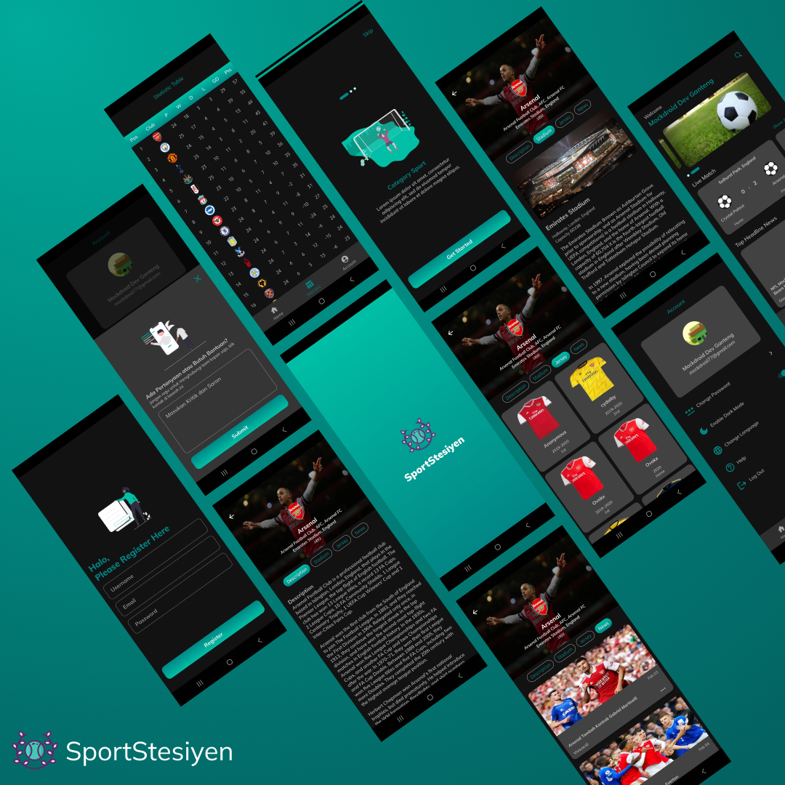

  

# SportStesiyen
SportStesiyen is a Sport app for study case built completely using Kotlin. Under the hood, it uses the various kind of API to fetch the data then uses many library's such as Koin, Retrofit, Coroutines, LiveData and I built this project purely for educational purposes.

## Tech Stack
- Entirely written in [Kotlin](https://kotlinlang.org/).
- [Retrofit](https://square.github.io/retrofit/) for communicating with the Sport API.
- [Google's palette api](https://developer.android.com/develop/ui/views/graphics/palette-colors) for color extraction from image.
- [Koin](https://insert-koin.io/).
- [Coroutines](https://github.com/Kotlin/kotlinx.coroutines).
- [LiveData](https://developer.android.com/topic/libraries/architecture/livedata?hl=id).
- [Firebase Auth](https://firebase.google.com/docs/auth/android/manage-users?hl=id&authuser=1).

## Source code and architecture
- All concrete implementations are prefixed by the term "SportStesiyen".
- Uses multi-repository pattern.
- MVVM archtecture.
- Documentation Api by [Sport Api](https://www.thesportsdb.com/).
